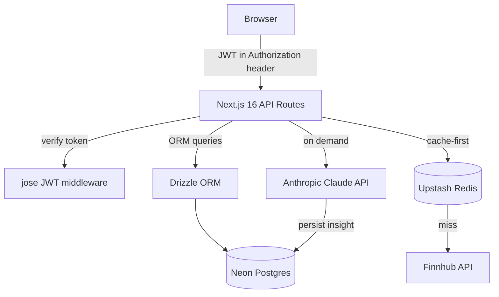

# FinSight AI

A multi-tenant financial portfolio dashboard with live stock quotes and AI-generated insights — sitting at the intersection of FinTech data processing, SaaS multi-tenancy, and modern AI integration.

**[Live Demo](https://finsight-ai-xi-sandy.vercel.app)**

> Demo credentials: `demo@finsight.ai` / `Demo1234!`

---

## What it does

- **Portfolio management** — Create named portfolios, add/remove stock holdings with shares and average cost
- **Live stock quotes** — Real-time prices via Finnhub API, refreshed every 60 seconds
- **P&L tracking** — Unrealized gain/loss per position and across the full portfolio, updated live
- **Interactive charts** — 30-day area performance chart and allocation donut chart via Recharts
- **AI insights** — On-demand portfolio commentary generated by Claude (Anthropic), persisted in Postgres
- **Secure multi-tenancy** — Every portfolio and holding is strictly scoped to its owner via JWT auth

---

## Architecture



**Request flow for a stock quote:**

1. API route checks Redis for `quote:{TICKER}` key
2. On hit → return cached price (TTL: 60 s)
3. On miss → call Finnhub, write to Redis, return fresh price

---

## Key technical decisions

### Stateless JWT authentication

Sessions are encoded entirely in a signed JWT (`jose` library, HS256, 7-day expiry). No session table, no sticky sessions — any Vercel edge node can verify a request independently. Logout is client-side token removal plus React Query cache clear to prevent stale data leaking between users on shared devices.

### Redis quote caching

Finnhub's free tier allows 60 requests/minute. With multiple users and a 60-second polling interval per client, hitting the API directly would exhaust the quota instantly. Every quote is cached in Upstash Redis with a 60-second TTL — only cold reads (first request per ticker per minute) hit Finnhub.

### AI insights stored in Postgres, not regenerated on load

Claude API calls cost money and take time. Insights are generated once on explicit user action and written to the `ai_insights` table. Subsequent loads read from Postgres. This balances freshness with cost and latency.

### React Query for server state

All async data (portfolios, quotes, insights) lives in React Query. The `refetchInterval: 60_000` on the quotes query drives the live update behaviour. Stale-while-revalidate keeps the UI responsive — users always see the last known price while a background fetch runs.

### Drizzle ORM over raw SQL or heavier ORMs

Drizzle is fully type-safe and generates zero runtime overhead — the query builder compiles to plain SQL with no reflection or proxy magic. It works natively with Neon's serverless driver, making it the natural fit for a Vercel deployment where cold starts matter.

---

## Database schema

```
users         id, first_name, last_name, email, password_hash, role, created_at
portfolios    id, user_id → users, name, created_at
holdings      id, portfolio_id → portfolios, ticker, shares, avg_cost, added_at
              UNIQUE (portfolio_id, ticker)
ai_insights   id, portfolio_id → portfolios, content, generated_at
```

The `UNIQUE (portfolio_id, ticker)` constraint on holdings prevents duplicate positions and enforces clean data at the DB level rather than relying on application logic.

---

## API reference

| Method   | Route                                    | Description                |
| -------- | ---------------------------------------- | -------------------------- |
| `POST`   | `/api/auth/register`                     | Create account             |
| `POST`   | `/api/auth/login`                        | Get JWT token              |
| `GET`    | `/api/auth/me`                           | Current user profile       |
| `GET`    | `/api/portfolio`                         | List user's portfolios     |
| `POST`   | `/api/portfolio`                         | Create portfolio           |
| `GET`    | `/api/portfolio/:id`                     | Portfolio with holdings    |
| `DELETE` | `/api/portfolio/:id`                     | Delete portfolio           |
| `POST`   | `/api/portfolio/:id/holdings`            | Add holding                |
| `DELETE` | `/api/portfolio/:id/holdings/:holdingId` | Remove holding             |
| `GET`    | `/api/quotes?tickers=AAPL,MSFT`          | Live quotes (Redis-cached) |
| `GET`    | `/api/tickers?q=apple`                   | Ticker search              |
| `GET`    | `/api/ai-insights/:portfolioId`          | Latest AI insight          |
| `POST`   | `/api/ai-insights/:portfolioId`          | Generate new AI insight    |

All protected routes require `Authorization: Bearer <token>`. All responses follow `{ data }` on success and `{ error: string }` on failure.

---

## Local setup

### Prerequisites

- Node.js 18+
- A [Neon](https://neon.tech) Postgres database
- An [Upstash](https://upstash.com) Redis database
- A [Finnhub](https://finnhub.io) API key (free tier)
- An [Anthropic](https://anthropic.com) API key

### 1. Clone and install

```bash
git clone https://github.com/jk-14/finsight-ai.git
cd finsight-ai
npm install
```

### 2. Environment variables

Create a `.env.local` file in the project root:

```env
# Database
DATABASE_URL=postgresql://...

# Redis
UPSTASH_REDIS_REST_URL=https://...
UPSTASH_REDIS_REST_TOKEN=...

# Auth
JWT_SECRET=your-secret-key-min-32-chars

# Stock data
FINNHUB_API_KEY=your_finnhub_key

# AI
ANTHROPIC_API_KEY=sk-ant-...
```

### 3. Push schema and seed

```bash
# Push schema to Neon
npx drizzle-kit push

# Seed the demo account
npx tsx scripts/seed.ts
```

### 4. Run

```bash
npm run dev
```

Open [http://localhost:3000](http://localhost:3000). Log in with `demo@finsight.ai` / `Demo1234!`.

---

## Deployment

The project is zero-config on Vercel. Set the environment variables above in the Vercel dashboard and deploy.

```bash
vercel --prod
```

---

## Tradeoffs and production notes

This is a portfolio POC with deliberate scope constraints. In a production system:

| Area                 | POC approach                     | Production approach                                  |
| -------------------- | -------------------------------- | ---------------------------------------------------- |
| **Auth**             | JWT in localStorage              | HttpOnly cookie + refresh token rotation             |
| **Quote source**     | Finnhub free tier (60 req/min)   | Paid market data feed with WebSocket streaming       |
| **AI regeneration**  | Manual trigger only              | Scheduled nightly regeneration via cron              |
| **Input validation** | Basic `typeof` runtime checks    | Zod schemas at every API boundary                    |
| **Testing**          | Deferred in favour of breadth    | Integration tests against a real DB, not mocks       |
| **Rate limiting**    | None                             | Per-user rate limiting on AI and quote endpoints     |
| **DB migrations**    | `drizzle-kit push` (destructive) | `drizzle-kit migrate` with versioned migration files |

---

## Tech stack

| Layer        | Technology                 |
| ------------ | -------------------------- |
| Framework    | Next.js 16 (App Router)    |
| Language     | TypeScript (strict mode)   |
| Database     | Neon Postgres (serverless) |
| ORM          | Drizzle ORM                |
| Cache        | Upstash Redis              |
| Auth         | JWT via `jose`             |
| Stock data   | Finnhub API                |
| AI           | Anthropic's Claude SDK     |
| Server state | TanStack React Query       |
| UI           | shadcn/ui + Tailwind CSS   |
| Charts       | Recharts                   |
| Deployment   | Vercel                     |

---

_Built by [Jatin](https://github.com/jk-14)_
